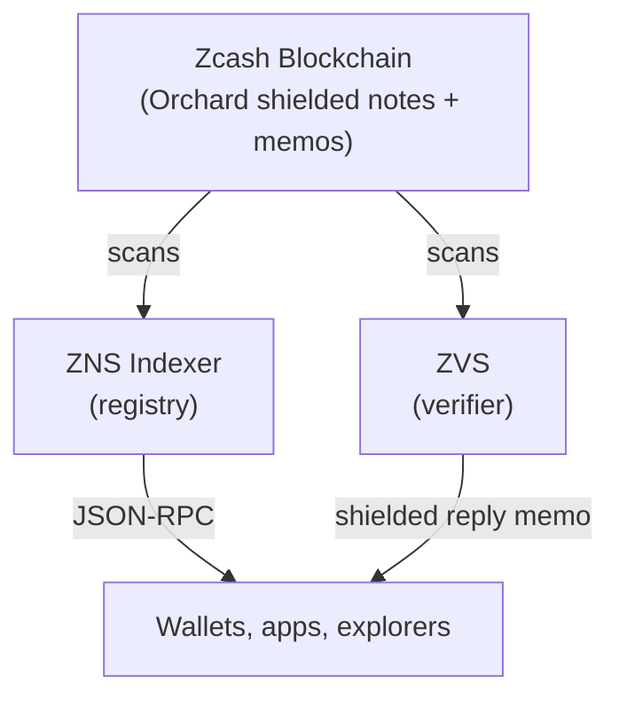

# How it works

ZcashNames is a small protocol layered on top of standard Zcash.

## The four moving parts

- **Zcash blockchain** is the source of truth. Every ZcashNames action is a memo in a normal shielded transaction.
- **Indexer** watches the chain, verifies memos, and builds the registry. Anyone can run one. They all produce the same result.
- **ZVS** handles ownership proofs via shielded one-time codes. It never touches the registry.
- **Wallets, apps, explorers** read from the indexer over a JSON-RPC API.

## Claiming a name

1. Search for an available name and provide your unified address.
2. The app gets a signed `CLAIM` memo from the admin server.
3. Your wallet broadcasts a shielded transaction carrying that memo and the claim cost.
4. The indexer verifies and indexes it. From that block on, `resolve("alice")` returns your address.

The registration comes back with a signature so any client can verify it without trusting the indexer. See [Trust Model](/docs/protocol/trust-model).

## Read next

- [Name lifecycle](/docs/learn/name-lifecycle)
- [Trust model](/docs/protocol/trust-model)
- [Claim a name](/docs/use/claiming)
